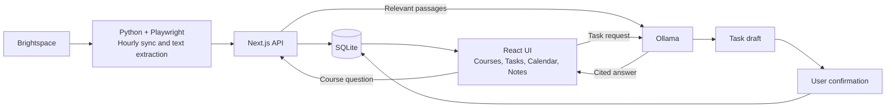

# Hackathon

A local learning assistant built on [Bulter](https://github.com/frankrainrp/Bulter): course progress, tasks, reminders and AI.

## Quick Start — VS Code on Windows

1. Install [VS Code](https://code.visualstudio.com/), Microsoft Edge and [Ollama](https://ollama.com/download/windows). Keep Ollama running.
2. Go to [Releases](https://github.com/frankrainrp/Hackathon/releases/latest) → **Assets** → download **`Butler-LMS-Windows.zip`** and extract it. Node and Python are included.
3. In VS Code, choose **File → Open Folder**. Select the extracted **`Butler-LMS-Windows`** folder containing `portable-launch.ps1`.
4. Choose **Terminal → New Terminal**, select **PowerShell**, and run these commands from that folder:

```powershell
ollama pull qwen3:0.6b
$env:OLLAMA_SERVER_MODEL = "qwen3:0.6b"
powershell -NoProfile -ExecutionPolicy Bypass -File .\portable-launch.ps1
```

[Qwen3 0.6B](https://ollama.com/library/qwen3:0.6b) is a lightweight starter model: approximately **523 MB** to download. The environment variable selects it for this launch.

Complete the school login in the dedicated Edge window; hourly sync starts automatically. For a demo without school login, use this launch command instead:

```powershell
powershell -NoProfile -ExecutionPolicy Bypass -File .\portable-launch.ps1 -Demo
```

Open [Courses](http://127.0.0.1:3000/?view=courses), expand a module and select **Ask course AI**. Switch Chinese / English at the top. In **Chat**, ask “Create a task to review Lesson 1 tomorrow,” confirm the draft, then manage it in **Tasks** or **Calendar**.

## Architecture



Edit `my-app/ops/lms-sync/config.local.json` to change courses, sync frequency or download location. [Detailed setup](my-app/ops/lms-sync/README.md). Personal files and credentials are excluded from Git. Scanned course files need OCR; DeepTutor is not integrated yet.
